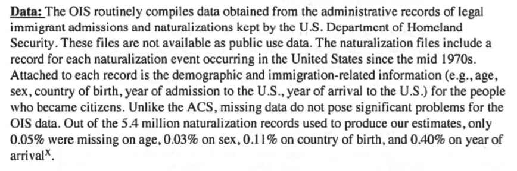

---
title: Notes on the administrative record about the 2020 census citizenship question
author: Brian Morris
date: July 10, 2019
---

**Summary:** I skimmed through the Department of Commerce administrative
record related to the issue of adding a question about citizenship to
the short form 2020 census. I was looking for information about
"administrative data" that the Census Bureau could potentially pull
from other agencies (mainly federal for the citizenship information, but
agencies on the state and local level do supply other types of
information) in order to get information about the citizenship status of
surveyed people without having to put an explicit question about
citizenship on the census form. The goal of this search was to identify
possible sources of data on the citizen and citizen voting age
population at the level of Census block groups, which the American
Community Survey sources that we were using did not supply. I found
several candidate agencies (namely, the Social Security Agency
"Numident" file, the Immigration and Naturalization Service, the
Office of Immigration Statistics, the U.S. Citizenship and Immigration
Services, and the State Department), but as the data are sensitive and
not public, I think that trying to acquire the information we need from
these agencies would be difficult, time-consuming, and not necessarily
very likely to succeed.

URL of the administrative record:
<https://www.documentcloud.org/documents/4500011-1-18-Cv-02921-Administrative-Record.html>

The following are notes from sections that seemed relevant. Numbers in
parentheses indicate page numbers in the PDF, and highlights indicate
pieces of information that seemed especially relevant to the question of
where exactly these administrative records (in particular the ones about
citizenship) might come from.

  - Page 67: 2010 census match study
    
      - "In response to calls from external researchers and the National
        Academies of Science, the Census Bureau developed StARS 1999 to
        research the use of administrative data in decennial census
        operations. StARS 1999 was assembled from six administrative
        records sources: (1) Internal Revenue Service (IRS) Individual
        Income Returns, (2) IRS Information Returns, (3) Department of
        Housing and Urban Development (HUD) Tenant Rental Assistance
        Certification System (TRACS), (4) Center for Medicare and
        Medicaid Services (CMS) Medicare Enrollment Database (MEDB), (5)
        Indian Health Service (IHS) Patient Registration System, and (6)
        Selective Service System (SSS) Registration System (Farber and
        Leggieri 2002). In StARS 2000, and for subsequent years, an
        additional source file was added, (7) the HUD Public and Indian
        Housing Information Center (PIC) file" (82).
    
      - Federal and commercial data used in this report (84):
        
          - Federal data from other agencies
            
              - IRS: Individual Income Tax Returns 1040 and Information
                Returns 1099
            
              - HUD: PIC, TRACS, and CHUMS
            
              - Social Security Administration (SSA): Supplemental
                Security Record (SSR) file for Supplemental Security
                Income (SSI) recipients
                
                  - also the Death Master File
            
              - CMS: MEDB
            
              - Selective Service
            
              - IHS: Patient Registration File
            
              - Postal Service: National Change of Address file
            
              - TANF files for demographic info
        
          - 2010 Census data
        
          - Commercial data (85)
            
              - 9 data files with identifying info and demographics from
                5 commercial data vendors
            
              - Multiple data sets from 3 vendors:
                
                  - Experian
                    
                      - In-Source file
                    
                      - End-Dated Records file
                
                  - Targus
                    
                      - Federal Consumer file
                    
                      - Pure Wireless file
                    
                      - National Address File
                
                  - Veteran Service Group of Illinois
                    
                      - Name and Address Resource Consumer file
                    
                      - TrackerPlus file
            
              - Other vendors (I think the difference being that these
                gave one file each)
                
                  - InfoUSA
                
                  - Melissa Data Base Source
            
              - Seems that the commercial data is mostly about
                addresses, race, age, sex, Hispanic origin, and so
                forth, not citizenship status (which makes sense).
                Actually, this match report more broadly appears to be
                concerned with stuff like person- and address-matching
                and age, sex, and race, rather than citizenship.

  - Page 295: academic paper on how well the ACS counts naturalized
    citizens, mentions comparing it against administrative data
    
      - So whatever data they have access to, we might have a chance at
        accessing it too
    
      - 297: administrative data on citizenship from the Immigration and
        Naturalization Service
    
      - 299: they "estimated the number of naturalized citizens by age
        group, sex, region of origin, and duration of residence based on
        the number of Office of Immigration Statistics (OIS)
        naturalization records"
    
      - 302:

          -  

          - 
        
          - Data are not public, thus, while it might be conceivably
            *possible* for us to get similar data, it might require a
            lot of effort and would not be guaranteed to work
    
      - 303: limited to over-18 because OIS data for minors is sketchy.
        They also note other issues with the data.

  - Page 338: Presentation to Commerce Secretary on the use of
    administrative records in the 2020 census
    
      - Page 342 lists some example sources, which are about the same as
        the ones described above
    
      - P. 346: lists various types of data that can be gotten from
        various sources, doesn’t list citizenship

  - Page 443: mentions DOJ request for citizenship question, says that
    the request is currently under evaluation by DOC
    
      - p. 451 says the same

  - Page 468: makes a comparison of 2010 Census and ACS response rates
    *by citizenship status* based on 2010 Numident data
    
      - Numident: Numerical Identification System, "the Social Security
        Administration's computer database file of an abstract of the
        information contained in an application for a United States
        Social Security number (Form SS-5)" (Wikipedia).

  - Page 536: Census Bureau administrative data inventory
    
      - gives type of data but not what kind it is, i.e. doesn’t say
        where citizenship info might come from

  - P. 667: State and tribal administrative data, 3-19-2018

  - 671: Block level citizenship data from administrative records\!
    
      - Census Bureau is talking to the Social Security Administration
        (SSA) (Numident, primary supplier of citizenship info), U.S.
        Citizenship and Immigration Services (USCIS), and the State
        Department

  - 1289: memo recommending use of administrative data over adding a
    citizenship question
    
      - 1295: more detailed analysis of use of admin data
    
      - again, seems like Numident with augmentation from USCIS is what
        they use
